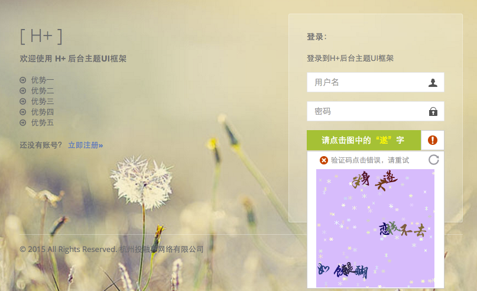
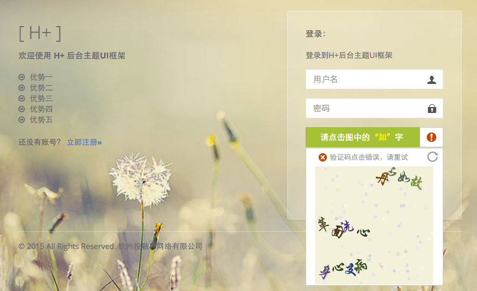
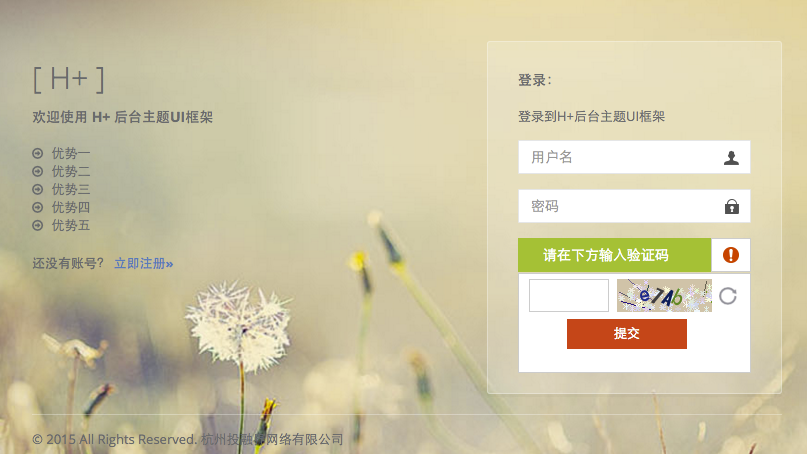

#ThinkNoCaptcha

参照淘宝注册验证实现的No-CAPTCHA验证库，No-CAPTCHA是GOOGLE推出的一项验证码服务，国内有类似的实现比如极验。

###实现步骤

下载成语库SQL,写到MYSQL数据表中，为了加快访问速度，首次加载将这些成语写入到redis缓存中(缓存所有-小于或等于七个汉字的成语数据)，以后加载就不需要查询mysql数据库了。

通过PHP函数array_rand返回一个随机成语的3个键名数组,通过redis的hmget方法就可以取出三个随机的成语。

之后在计算无重复标识汉字，分拆汉字，过滤逗号，获取唯一性的验证汉字集合，在通过array_rand返回一个随机标识汉字，将此标识汉字和三条成语记录下来。接下来生成背景图片，在背景图片的基础上随机位置将前面生成三条成语转成图片附加在背景上，生成成语的过程也在拆分汉字，并计算各个汉字的坐标位置，并记录下来，当生成的汉字与标识汉字一样时，才真正把此坐标位置保存下来。

有了坐标区域，此时就可以通过鼠标点击来确定是否与Session中存储的坐标一致，进而达到验证的目的。

